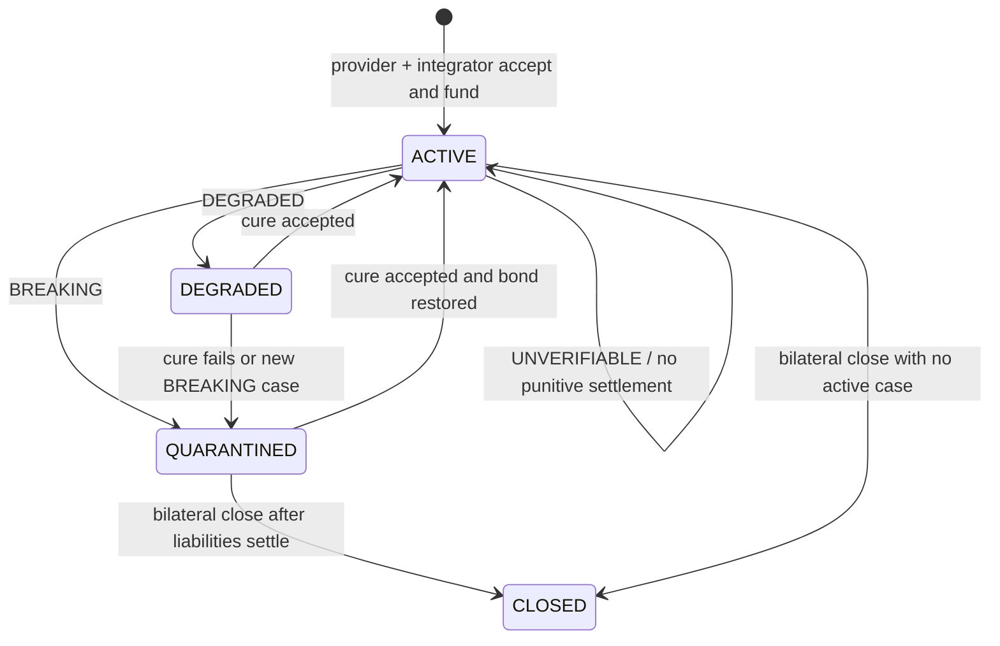

# IDEA-001 — Semantic Interface Covenant

**Trạng thái:** `DEPLOYED_STUDIONET`

**Ngày khóa ý tưởng:** 2026-07-26

**Contract:** `SemanticInterfaceCovenant`

**Studionet:** primitive
[`0x05b27207c7aC50d22E5C1afBfD3c20DBccCa0570`](https://explorer-studio.genlayer.com/address/0x05b27207c7aC50d22E5C1afBfD3c20DBccCa0570),
enforcement guard
[`0xA58132c068E0406E2d5d43E8b72E2b2361ac057D`](https://explorer-studio.genlayer.com/address/0xA58132c068E0406E2d5d43E8b72E2b2361ac057D).

**Deploy transactions:** primitive
[`0xd6cc527f...b48a47`](https://explorer-studio.genlayer.com/tx/0xd6cc527f3e0382c41da91e235d969b632bcb023a082bae8c6e1e921c22b48a47),
guard
[`0x972bdc31...f1b8e`](https://explorer-studio.genlayer.com/tx/0x972bdc31463fe87b9cb633e0739c1357b41f9c23e043490ebd8c05c4234f1b8e).

**Evidence đầy đủ:** [evidence/studionet/deployment.json](evidence/studionet/deployment.json)

**Builder integration:** [INTEGRATION.md](INTEGRATION.md)

**Submission notes:** [SUBMISSION.md](SUBMISSION.md)

**Live result:** validators phán commit SDK v2 là `BREAKING/CRITICAL`, binding
chuyển `ACTIVE → QUARANTINED`, guard chuyển `can_route=true → false`, và `1 GEN`
service credit được quyết toán cho integrator. Validators sau đó phán nguồn
encoder ổn định là `CURED`; binding và guard trở lại `ACTIVE`, route hoạt động
lại. Integrator đã rút `1.1 GEN` credit về ví, nên settlement đã được kiểm
chứng bằng thay đổi số dư thật chứ không chỉ bằng ledger nội bộ.

**Implementation hiện tại:** [IMPLEMENTATION.md](IMPLEMENTATION.md)

## 1. Tóm tắt

`SemanticInterfaceCovenant` là một trust primitive cho public API, MCP server
và agent tool: provider và integrator cùng chấp nhận trước các bảo đảm về hành
vi; nếu interface thay đổi, GenLayer validators kiểm bằng chứng công khai và
phán thay đổi đó `COMPATIBLE`, `DEGRADED`, `BREAKING` hay `UNVERIFIABLE`.
Verdict trực tiếp quarantine/restore integration và quyết toán bond đã khóa.

**Demo hook:** một MCP tool vẫn trả HTTP 200 và JSON đúng schema nhưng âm thầm
đổi đơn vị `price` từ USD sang cents. Deterministic health check báo “healthy”;
Semantic Interface Covenant nhận ra nghĩa đã thay đổi, quarantine tool và trả
service credit từ provider bond cho integrator.

## 2. Vấn đề tin cậy thật

API/tool provider có thể sửa documentation, release notes hoặc behavior rồi
khẳng định thay đổi vẫn tương thích. Integrator phụ thuộc vào interface đó có
thể chịu mất tiền, agent chạy sai hoặc automation ra quyết định sai. Ngược lại,
integrator cũng có thể tố sai để đòi bồi thường.

Hai bên không nên buộc phải tin:

- provider tự kết luận “không breaking”;
- integrator tự kết luận “breaking”;
- một monitoring SaaS hoặc một LLM backend duy nhất;
- một schema diff chỉ nhìn hình dạng dữ liệu.

Quyết định cần GenLayer là:

> Dựa trên covenant đã được hai bên chấp nhận và các nguồn công khai đã được
> cho phép, behavior hiện tại có vi phạm một guarantee ID đủ để đổi trạng thái
> integration và kích hoạt settlement hay không?

Đây là consensus-critical decision. Frontend chỉ thu thập tham số và hiển thị;
không được tự tính verdict rồi gửi raw JSON vào contract.

## 3. Fingerprint chống trùng

**Trust problem:** provider và integrator tranh chấp liệu một public
API/MCP/tool còn giữ đúng các bảo đảm ngữ nghĩa đã chấp nhận hay không.

**Actors/adversary:** provider có động cơ che giấu breaking change để giữ bond
và khách hàng; integrator/claimant có động cơ phóng đại incident để nhận credit;
source website có thể chứa nội dung gây prompt injection.

**Evidence class:** versioned public specification/manifest, public
documentation, release notes, provider status page và bounded GET probe thuộc
các domain đã chấp nhận.

**Consensus question:** phân loại compatibility, severity, source coverage và
tập guarantee ID bị vi phạm.

**State machine:** `Covenant → Binding → Case → Verdict → Cure`; mỗi binding có
status và bond riêng, mỗi case có identity và settlement riêng.

**Direct consequence:** `ACTIVE/DEGRADED/QUARANTINED`, service-credit transfer,
challenge-bond disposition và finalized notification tới subscriber contract.

**Reuse surface:** provider đăng covenant; integrator tạo binding; watcher mở
case; consumer đọc `get_binding_status` hoặc subscribe để pause một dependency.

## 4. Vì sao đây là một primitive, không phải app một lần

Primitive không phụ thuộc một campaign, bảng điểm, ngành hoặc loại bounty cụ
thể. Nó chuẩn hóa một protocol có thể dùng lại:

1. đăng một versioned interface covenant;
2. tạo bilateral binding có bond và consequence policy;
3. nộp incident từ nguồn đã thỏa thuận;
4. validator adjudicate semantic compatibility;
5. contract quarantine/restore và settlement;
6. consumer contract phản ứng với trạng thái.

Builder có thể tích hợp nó cho:

- MCP/tool marketplace tự động gỡ tool khỏi routing;
- agent payment workflow dừng trả tiền cho tool phá covenant;
- DAO automation pause một job phụ thuộc API;
- data/DeFi adapter ngừng dùng provider có semantic breaking change;
- SaaS integration thực hiện service-credit settlement theo thỏa thuận.

## 5. Scope v1

V1 chỉ hỗ trợ:

- interface công khai, không cần cookie/API key;
- HTTPS `GET` hoặc public static documents;
- domain và path-prefix được hai bên chấp nhận trước;
- số source/probe, response size và timeout bị giới hạn;
- guarantee được tách thành ID có mô tả rõ;
- GEN bond và service credit theo policy định trước;
- một active case trên mỗi binding để tránh race settlement;
- notification chỉ phát khi parent verdict finalized.

### Non-goals

- Không tự tuyên bố một phán quyết pháp lý hoặc thay tòa án.
- Không truy cập private API secret vì validator không thể kiểm độc lập.
- Không thay thế deterministic OpenAPI/schema diff. Nếu diff xác định được hoàn
  toàn bằng code, xử lý offchain hoặc deterministic contract trước.
- Không đánh giá uptime đơn thuần; health watchdog phù hợp hơn.
- Không chấm “API tốt hay xấu” bằng một rubric mở.
- Không tự chặn một request offchain. Consumer phải đọc status hoặc tích hợp
  subscriber/adaptor mới có enforcement.
- Không dùng arbitrary POST/PUT/DELETE, không chạy code từ response.

## 6. Actors và động cơ

| Actor | Quyền | Động cơ/rủi ro |
|---|---|---|
| Provider | Tạo covenant version, chấp nhận binding, nộp cure, khóa bond | Có thể che giấu breaking change hoặc sửa source sau incident |
| Integrator | Chấp nhận covenant, mở case, nhận credit, chọn subscriber | Có thể tố sai hoặc spam case để rút bond |
| Authorized watcher | Mở case thay integrator nếu binding cho phép | Có thể spam hoặc gửi evidence URL độc hại |
| Validators | Fetch nguồn và adjudicate | Có thể gặp nguồn khác thời điểm hoặc diễn giải khác |
| Consumer contract | Đọc status/nhận message finalized | Phải idempotent và không tin event chưa finalized |
| Governance/admin v1 | Chỉ cấu hình giới hạn protocol, không sửa verdict | Centralization risk; không được rút bond hoặc overwrite case |

## 7. Data model và isolation

Tên field dưới đây là design target; type chính xác sẽ được khóa khi prototype
với phiên bản `py-genlayer` hiện tại.

### Covenant

```text
covenant_id
provider_address
version
title
interface_kind              API | MCP | AGENT_TOOL
approved_source_rules[]
guarantees[]
default_policy
created_at
supersedes_covenant_id
active
```

Mỗi `guarantee` có:

```text
guarantee_id
statement
criticality                 REQUIRED | IMPORTANT | ADVISORY
evidence_hint
```

Guarantee ID là immutable trong một covenant version. Version mới không được
sửa lịch sử version cũ.

### Binding

```text
binding_id
covenant_id
provider_address
integrator_address
authorized_watcher
subscriber_contract
provider_bond
minimum_challenge_bond
service_credit_policy
status                      ACTIVE | DEGRADED | QUARANTINED | CLOSED
active_case_id
created_at
closed_at
```

Provider và integrator có thể dùng cùng covenant cho nhiều binding, nhưng bond,
case và status phải cô lập theo `binding_id`.

### Case

```text
case_id
binding_id
opened_by
claim_summary
observation_urls[]
challenge_bond
baseline_covenant_id
status                      OPEN | RESOLVED
verdict_id
opened_at
resolved_at
```

### Verdict

```text
verdict_id
case_id
compatibility_class         COMPATIBLE | DEGRADED | BREAKING | UNVERIFIABLE
severity_band               NONE | LOW | MEDIUM | HIGH | CRITICAL
violated_guarantee_ids[]
source_coverage             SUFFICIENT | PARTIAL | FAILED
required_action             KEEP_ACTIVE | WARN | QUARANTINE | RETRY
rationale
settlement_amount
previous_binding_status
new_binding_status
decided_at
```

### Cure

```text
cure_id
binding_id
parent_verdict_id
submitted_by
cure_urls[]
status                      SUBMITTED | ACCEPTED | REJECTED | UNVERIFIABLE
decided_at
```

Lịch sử covenant, case, verdict và cure là append-only. Không có
`last_verdict`, `last_policy` hoặc global field mà caller bất kỳ có thể ghi đè.

## 8. State machine



Một binding chỉ có một active case. Verdict resolution phải atomically:

1. kiểm `case.status == OPEN`;
2. ghi verdict mới;
3. cập nhật binding status;
4. đánh dấu case `RESOLVED`;
5. cập nhật ledger bond;
6. phát message/transfer chỉ với `on='finalized'`.

Nếu bất kỳ invariant nào sai, toàn bộ write phải fail; không được settlement
một phần rồi để case mở.

## 9. Evidence protocol

### Baseline được chấp nhận trước

Khi tạo covenant, provider khai báo:

- canonical specification/manifest URL;
- documentation và release-note URL;
- approved scheme, hostname và path-prefix;
- content hash của baseline snapshot nếu có;
- từng guarantee ID và evidence hint;
- probe URL không có side effect.

Integrator nhìn thấy toàn bộ baseline trước khi chấp nhận binding. Sau khi
binding active, provider không thể đổi source rules hoặc guarantee trong version
đó; phải tạo covenant version mới và integrator chấp nhận lại.

### Evidence lúc mở case

Claimant chỉ được cung cấp URL nằm trong source rules hoặc observation domain
đã cho phép. Contract không tin `claim_summary` là sự thật; validator phải fetch
và so với baseline.

Ưu tiên nguồn:

1. versioned provider manifest/spec;
2. provider documentation/release notes;
3. bounded live probe;
4. status page;
5. observation bổ sung đã được cả binding cho phép.

### Failure policy

- Nguồn cốt lõi không truy cập được hoặc mâu thuẫn không thể giải quyết:
  `UNVERIFIABLE`, không slash provider.
- Chỉ nguồn phụ lỗi nhưng baseline và probe đủ: có thể `SUFFICIENT`.
- Content vượt size/timeout: xem nguồn đó failed, không tải không giới hạn.
- Redirect ra ngoài allowlist: từ chối.
- Private/authenticated source: từ chối ở v1.
- Response thay đổi theo validator/time: giảm coverage; nếu ảnh hưởng field
  critical thì `UNVERIFIABLE`.

## 10. Exact consensus question

Leader và validator cùng đánh giá:

> Với guarantee list của covenant version đã khóa, baseline sources, current
> sources và bounded observation của case, behavior hiện tại thuộc lớp nào; các
> guarantee ID nào bị vi phạm; severity, source coverage và required action là
> gì?

Họ không được đánh giá chất lượng chung của provider, mức thiệt hại pháp lý,
hoặc tự tạo thêm điều khoản ngoài covenant.

### Decision rules

| Class | Điều kiện nghĩa |
|---|---|
| `COMPATIBLE` | Không có guarantee bị vi phạm; khác biệt nằm trong allowed change |
| `DEGRADED` | Có vi phạm `IMPORTANT/ADVISORY` hoặc rủi ro có thể cure, chưa phá guarantee bắt buộc |
| `BREAKING` | Ít nhất một `REQUIRED` guarantee bị vi phạm với evidence đủ |
| `UNVERIFIABLE` | Evidence không đủ/không ổn định để kết luận an toàn |

Deterministic pre-check có thể canonicalize URL, ID, size và schema. Nondeterministic
evaluation chỉ xử lý nghĩa của documentation/behavior so với guarantee.

## 11. Equivalence principle

Consensus-critical fields:

- exact `compatibility_class`;
- exact `severity_band`;
- exact `required_action`;
- exact `source_coverage`;
- exact set `violated_guarantee_ids` sau khi sort/deduplicate và kiểm tất cả ID
  tồn tại trong covenant.

`rationale` không cần giống từng chữ. Nó chỉ hợp lệ nếu:

- ngắn trong giới hạn;
- dẫn chiếu guarantee ID và source index có thật;
- không thêm consequence ngoài policy;
- không chứa instruction được lấy từ web content.

Validator phải tự fetch/evaluate, không chỉ kiểm JSON shape của leader. Nếu hai
model diễn giải hợp lý nhưng khác câu chữ và đồng ý các field trên, kết quả là
tương đương. Nếu khác class hoặc required guarantee set, không tương đương.

## 12. Settlement và enforcement

### Bond

- Provider gửi GEN vào một payable binding để bảo đảm covenant.
- Người mở case gửi challenge bond tối thiểu để chống spam.
- Ledger lưu bond theo binding/case; không suy ra quyền sở hữu chỉ từ balance
  chung của contract.

### Policy v1

| Verdict | Binding | Challenge bond | Provider bond |
|---|---|---|---|
| `COMPATIBLE` | giữ `ACTIVE` | một phần/bộ phận theo policy chuyển cho provider hoặc protocol sink | không đổi |
| `DEGRADED` | thành `DEGRADED` | hoàn lại | chưa slash; bắt đầu cure path |
| `BREAKING` | thành `QUARANTINED` | hoàn lại | service credit giới hạn theo policy chuyển cho integrator |
| `UNVERIFIABLE` | giữ status trước hoặc đánh dấu cảnh báo UI | hoàn lại | không slash |

Không transfer vượt provider bond. Settlement amount là deterministic từ
verdict class và policy đã khóa, không để LLM tự chọn số tiền.

Value transfer hoặc subscriber message chạy `on='finalized'`, vì action ở
`accepted` có thể bị lặp hoặc trở nên sai sau appeal. Consumer nhận message phải
idempotent theo `verdict_id`.

### Consumer enforcement

Hai cách tích hợp:

1. **Pull:** consumer/frontend gọi `get_binding_status(binding_id)` trước khi
   dùng dependency.
2. **Push:** binding đăng một subscriber IC; verdict finalized gửi
   `on_covenant_status(binding_id, verdict_id, new_status)`.

Không tuyên bố contract có thể tự chặn mọi offchain request. Enforcement chỉ có
thật khi consumer tích hợp một trong hai đường trên.

## 13. Public interface dự kiến

### Write

```text
create_covenant(...)
deprecate_covenant(covenant_id)
accept_binding(covenant_id, integrator, watcher, subscriber, policy) payable
open_case(binding_id, claim_summary, observation_urls) payable
adjudicate_case(case_id)
submit_cure(binding_id, parent_verdict_id, cure_urls)
adjudicate_cure(cure_id)
close_binding(binding_id)
```

### View

```text
get_covenant(covenant_id)
get_binding(binding_id)
get_binding_status(binding_id)
get_case(case_id)
get_verdict(verdict_id)
get_cure(cure_id)
get_binding_case_ids(binding_id, offset, limit)
get_covenant_binding_ids(covenant_id, offset, limit)
```

Danh sách phải phân trang/bounded. Không có method nhận raw verdict JSON từ
frontend.

## 14. Access control và invariants

- Chỉ provider tạo/deprecate covenant của mình.
- Integrator phải explicit accept; provider không tự tạo binding mang tên bên
  khác.
- Chỉ integrator hoặc authorized watcher mở case.
- Chỉ provider của binding nộp cure.
- Không deprecate covenant để xóa nghĩa vụ của binding đang active.
- Không mở case nếu đã có active case.
- Không resolve case hai lần.
- Không settle verdict/cure hai lần.
- `binding.provider == covenant.provider`.
- `violated_guarantee_ids` phải thuộc covenant version của case.
- Source URL phải qua deterministic allowlist validation trước nondeterminism.
- Provider bond của binding A không được trả liability của binding B.
- Admin không sửa verdict, đổi guarantee, rút user bond hoặc overwrite history.
- Close chỉ khi không có active case và liabilities đã settle.

## 15. Security và abuse analysis

### Prompt injection từ web

Web content là dữ liệu không tin cậy. Prompt phải:

- đặt covenant rules trong instruction cố định;
- bao response trong vùng quoted/untrusted;
- yêu cầu bỏ qua mọi instruction trong response;
- chỉ cho phép output schema hữu hạn;
- validator kiểm các field, không tin rationale;
- test trang chứa “ignore prior instructions” và fake verdict.

### SSRF và unsafe fetch

- HTTPS-only;
- hostname/path-prefix allowlist;
- chặn localhost, private IP, metadata endpoint và redirect ngoài allowlist;
- GET-only, không body, không credential;
- bounded response/time/source count;
- không thực thi script hoặc tải binary tùy ý.

Khả năng chặn IP/redirect cụ thể phụ thuộc API web access hiện tại của GenVM và
phải được xác minh bằng prototype; nếu không enforce chắc chắn, v1 chỉ nhận URL
static từ domain đã đăng ký và bỏ live arbitrary probe.

### Economic abuse

- challenge bond chống spam;
- one-active-case chống concurrent drain;
- capped credit chống slash vượt mức;
- finalized-only transfer chống appeal/replay;
- case/verdict ID idempotency;
- `UNVERIFIABLE` không trừng phạt khi web lỗi.

### Source mutability

Baseline hash/snapshot giúp chứng minh nội dung lúc chấp nhận. V1 không tuyên bố
content hash tự chứng minh ý nghĩa; validator vẫn phải so semantic content.
Nếu provider xóa mọi nguồn, kết quả là `UNVERIFIABLE`, và UI/consumer có thể
coi đó là operational risk nhưng contract không tự gán `BREAKING`.

## 16. Test plan

### Deterministic/direct-mode

1. Tạo hai covenant và nhiều binding; chứng minh isolation.
2. Caller trái quyền không deprecate, mở case hoặc nộp cure được.
3. Không chấp nhận URL sai scheme/domain/path.
4. Không mở case thứ hai trên cùng binding.
5. Không resolve/settle cùng case hai lần.
6. Bond ledger không chảy chéo binding.
7. Settlement cap và arithmetic ở biên.
8. Close bị chặn khi còn case/liability.
9. Pagination và input length limits.

### Mocked nondeterministic evaluation

1. Schema và nghĩa giữ nguyên → `COMPATIBLE`.
2. Field mới optional → `COMPATIBLE`.
3. HTTP 200 nhưng đổi USD thành cents → `BREAKING`.
4. Tool giữ schema nhưng đảo nghĩa `approved` → `BREAKING`.
5. Deprecated advisory field → `DEGRADED`.
6. Required source biến mất → `UNVERIFIABLE`.
7. Nguồn phụ lỗi, nguồn chính đủ → coverage đúng policy.
8. Trang chứa prompt injection → không thay verdict schema/rules.
9. Leader trả guarantee ID không tồn tại → validator reject.
10. Leader và validator khác rationale nhưng cùng critical fields → equivalent.
11. Khác class/required ID → non-equivalent.

### Lifecycle/integration

1. Wallet ký `accept_binding` với GEN thật trong môi trường được chọn.
2. UI theo dõi pending → accepted → finalized.
3. UI đọc lại covenant/binding từ contract, không dùng localStorage làm nguồn
   sự thật.
4. Mở case, adjudicate, đọc verdict onchain.
5. Xác minh binding chuyển `QUARANTINED`.
6. Xác minh service credit transfer sau finalized.
7. Consumer demo ngừng dùng dependency từ state/message thật.
8. Nộp cure, adjudicate và restore `ACTIVE`.

Local mocks, Studionet và testnet evidence phải lưu riêng. Không dùng tx hash mô
phỏng làm bằng chứng testnet.

## 17. Claim-to-code matrix

| Claim | Contract/state bắt buộc | Test/UI evidence bắt buộc |
|---|---|---|
| “Per-integration covenant” | `Covenant`, `Binding`, mapping/index theo ID | Hai binding không ghi đè nhau; UI đọc đúng ID |
| “Validator đánh giá live evidence” | nondeterministic fetch + custom equivalence trong `adjudicate_case` | Mock và trace cho các verdict paths |
| “Bonded settlement” | payable methods, per-binding ledger, finalized transfer | Balance trước/sau và tx lifecycle |
| “Quarantine integration” | binding status transition | Consumer pull/push thật dừng dependency |
| “Cure và restore” | `Cure` append-only + adjudication | `QUARANTINED → ACTIVE` bằng state read |
| “Reusable primitive” | public views, bounded indexes, subscriber interface | Ít nhất một consumer sample độc lập |
| “Audit history” | append-only case/verdict/cure IDs | UI đọc history onchain, không chỉ hiển thị tx hash |

Nếu implementation thiếu một hàng, README không được giữ claim tương ứng.

## 18. So sánh với analogue gần nhất

| Analogue | Điểm giống | Khác biệt cấu trúc bắt buộc |
|---|---|---|
| CampaignScoreRegistry | Có dữ liệu theo dõi một hoạt động | IDEA-001 không nhận precomputed score/raw JSON; IC tự adjudicate evidence, có per-binding state, access control và settlement |
| Generic WebComplianceOracle | Đọc web và áp natural-language rules | Rules không tùy ý; có versioned guarantee IDs, bilateral acceptance, source allowlist, specialized verdict, quarantine/cure/bond protocol |
| Server health Watchdog | Bảo vệ consumer khỏi dependency hỏng | Watchdog phán availability; IDEA-001 phán semantic compatibility dù endpoint vẫn online |
| License compliance monitor | Theo dõi thay đổi policy/document | License hỏi quyền pháp lý; IDEA-001 hỏi interface behavior guarantee và có binding-specific enforcement |
| ACP deliverable evaluator | Validator so output với specification | ACP phán một job/deliverable; IDEA-001 quản lý interface version lâu dài, incident/cure và consumer quarantine |
| Intent escrow | Có bond/settlement | Intent escrow chọn/đánh giá execution một nhiệm vụ; IDEA-001 bảo vệ dependency interface qua nhiều incident |
| Deterministic OpenAPI diff | So sánh hai version | IDEA-001 chỉ dùng GenLayer cho nghĩa mơ hồ mà schema diff không kết luận được; deterministic diff vẫn là pre-check |

## 19. Đánh giá qua admission gates

| Gate | Kết quả | Lý do |
|---|---|---|
| Replacement | `PASS` | Backend/provider duy nhất không trung lập trong tranh chấp; signed DB chỉ chứng minh ai ghi, không phán semantic violation |
| Judgment | `PASS` | So meaning của guarantee với docs/probe cần diễn giải language/behavior |
| Evidence | `PASS có điều kiện` | V1 chỉ public, allowlisted, bounded sources; private API bị loại |
| Equivalence | `PASS` | Critical enum/set exact; rationale được phép khác |
| Consequence | `PASS` | Quarantine/restore, bond settlement, subscriber notification |
| Adversarial | `PASS` | Provider và claimant có lợi ích đối nghịch; challenge bond cân bằng |
| State model | `PASS ở mức thiết kế` | Per-ID entities, append-only history, one-active-case, idempotent settlement |
| Reuse | `PASS ở mức thiết kế` | Binding/view/subscriber interface áp dụng cho nhiều tool/API |
| Differentiation | `PASS theo khảo sát 2026-07-26` | Không trùng fingerprint legacy hoặc public analogues đã khảo sát |
| Claim-to-code | `PASS ở mức spec` | Matrix đã khóa; phải kiểm lại sau implementation |
| Full lifecycle | `PASS CONTRACT TRÊN STUDIONET / FRONTEND BROWSER WRITE PENDING` | Primitive, consumer, hai ví, consensus web/LLM, quarantine, cure, route enforcement và withdrawal đều đã finalized; vẫn cần ghi nhận một browser-wallet write qua frontend |
| Scope honesty | `PASS` | Tách rõ local verification, Studionet evidence, frontend code verification và phần browser/external adoption còn thiếu |

`Full lifecycle` chưa chứng minh không ngăn việc chọn ý tưởng để thiết kế, nhưng
ngăn mọi tuyên bố “submission-ready”.

## 20. Adoption path

### Consumer mẫu

`ToolRouterGuard` đã được build làm consumer độc lập:

- lưu `binding_id`;
- nhận finalized status từ đúng covenant contract;
- từ chối tool khi `QUARANTINED`;
- xử lý notification theo `verdict_id` idempotently.

7 direct tests chứng minh authorization, idempotency, degraded policy,
quarantine và cure/restore. Trên Studionet, finalized IC-to-IC notification đã
đổi guard sang `QUARANTINED`/`can_route=false`, cure notification đã khôi phục
`ACTIVE`, và hai request trước/sau tranh chấp đã được lưu onchain.

### Đường phát triển

1. Contract + direct tests cho full state/invariants và mocked consensus. ✅
2. Frontend vận hành đầy đủ create/accept/open/adjudicate/read/cure. ✅ local
3. Consumer contract chứng minh enforcement. ✅ direct mode
4. Studionet lifecycle với GEN test funds và evidence riêng. ✅
5. Public example covenant cho một API/MCP test fixture có version compatible
   và breaking.
6. Tài liệu integration để builder dùng `get_binding_status`/subscriber.

## 21. Kill criteria

Dừng hoặc thu hẹp ý tưởng nếu:

- semantic decision thực tế luôn rút gọn được thành deterministic schema diff;
- GenVM không thể giới hạn fetch đủ an toàn cho source model v1;
- không thể tạo consumer thật dùng status/message;
- settlement chỉ còn là con số hiển thị, không chuyển value;
- frontend không đọc state onchain;
- chỉ có một provider tự tạo case và tự hưởng lợi, không còn trust conflict;
- không tìm được ít nhất một builder/use case bên ngoài demo có nhu cầu tích
  hợp;
- khảo sát mới tìm thấy primitive công khai có cùng fingerprint mà IDEA-001
  không có khác biệt cấu trúc đáng kể.

## 22. Bằng chứng và tuyên bố hiện tại

Đã có:

- specification và anti-duplicate fingerprint;
- research comparison với legacy ideas và public analogue;
- xác nhận từ tài liệu chính thức rằng payable GEN, finalized value transfer và
  IC-to-IC message là primitive kỹ thuật khả dụng.
- contract source với structured per-entity storage, access control, payable
  bonds, nondeterministic adjudication, custom equivalence, cure và withdrawal;
- consumer contract `ToolRouterGuard` với authorization, idempotent finalized
  notification và route enforcement;
- frontend `/covenant` dùng GenLayer SDK thật cho read/write và lifecycle
  `submitted → decided → finalized`, không dùng localStorage làm state giả;
- 14 direct tests cho primitive và 7 direct tests cho consumer;
- `npm run check` pass ngày 2026-07-26: hai contract dự án lint sạch, 21 direct
  tests pass, không có fail/xfail, frontend typecheck và production build pass.
- visual QA local `/covenant` pass, không có browser console warning/error.
- primitive deployed tại
  `0x05b27207c7aC50d22E5C1afBfD3c20DBccCa0570` và consumer guard tại
  `0xA58132c068E0406E2d5d43E8b72E2b2361ac057D`;
- provider và integrator là hai EOA khác nhau; provider bond `2 GEN`, challenge
  bond `0.1 GEN`;
- live validators đọc hai commit chính thức của `genlayer-js`, phán
  `BREAKING/CRITICAL`, xác định đúng guarantee `method-key`, quarantine binding
  và chuyển `1 GEN` service credit cho integrator;
- live cure consensus phán `CURED`, khôi phục binding/guard và cho phép route
  trở lại;
- integrator rút thành công `1.1 GEN`; số dư EOA tăng từ `9.9` lên `11 GEN`,
  ledger credit về 0;
- toàn bộ address, transaction hash, finalized timestamp và state snapshot nằm
  trong [evidence/studionet/deployment.json](evidence/studionet/deployment.json).

Chưa có:

- một browser-wallet write được thực hiện trực tiếp qua frontend đã cấu hình
  deployed address;
- Asimov/Bradbury evidence;
- external adopter.

Vì vậy contract lifecycle trên Studionet đã được kiểm chứng, nhưng trạng thái
project vẫn là `BUILDING` cho tới khi browser-wallet lifecycle và hồ sơ
submission được hoàn tất; chưa tuyên bố “ready to submit”.

Runbook cho deployment và real evidence:
[DEPLOYMENT.md](DEPLOYMENT.md).

## 23. Nguồn thiết kế

- [When to Use GenLayer](https://docs.genlayer.com/developers/intelligent-contracts/when-to-use-genlayer)
- [Value Transfers](https://docs.genlayer.com/developers/intelligent-contracts/features/value-transfers)
- [Messages](https://docs.genlayer.com/developers/intelligent-contracts/features/messages)
- [Non-determinism](https://docs.genlayer.com/developers/intelligent-contracts/features/non-determinism)
- [Prompt Injection](https://docs.genlayer.com/developers/intelligent-contracts/security-and-best-practices/prompt-injection)
- [GenHub Projects](https://community.genhub.fun/projects)
